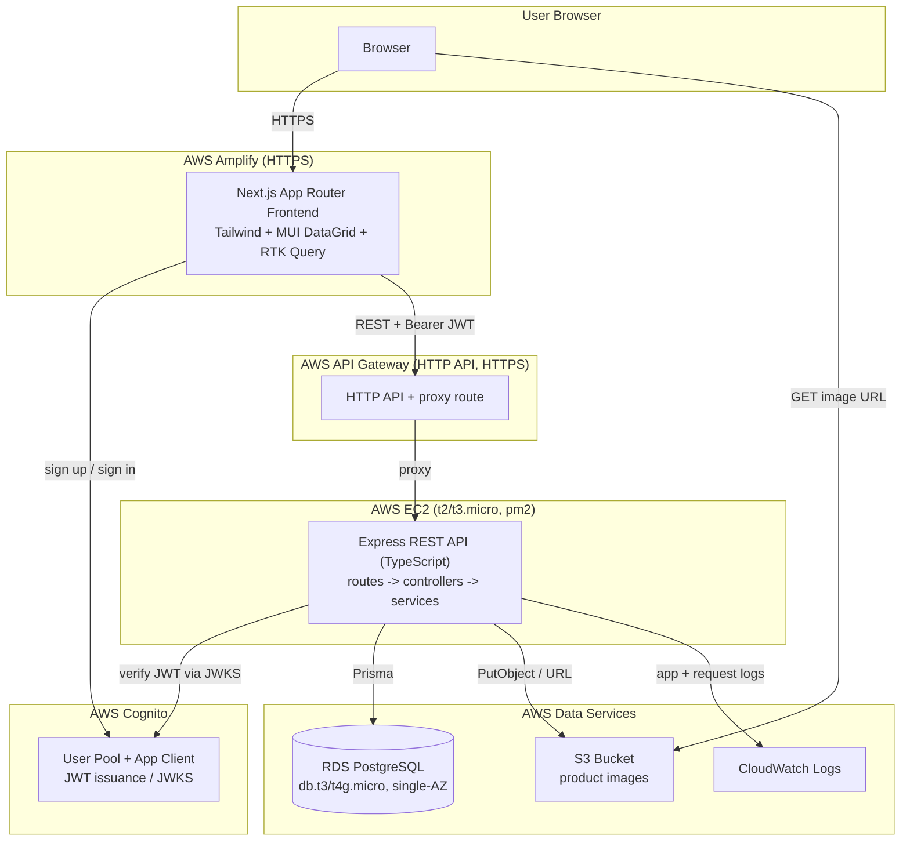
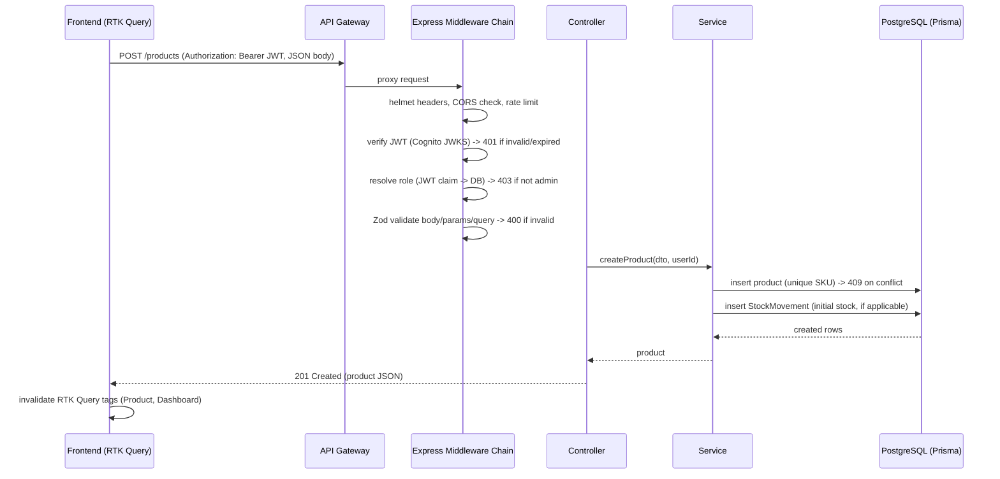
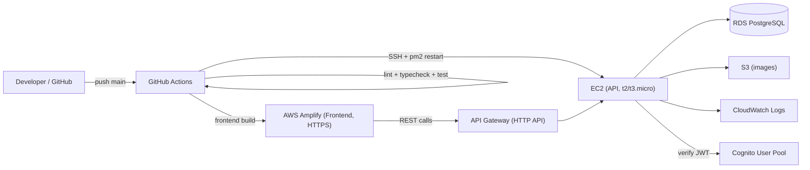

# Design Document

## Overview

The Inventory Management Dashboard is a full-stack, cloud-deployed web application composed of three cooperating tiers:

1. **Frontend** — A Next.js 15 (App Router, TypeScript) single-page-style application styled with Tailwind CSS. It renders the dashboard, product/expense/user management screens, global search, and settings. All server communication flows through a single Redux Toolkit Query (RTK Query) API definition. It is hosted on AWS Amplify.
2. **Backend API** — A Node.js/Express (TypeScript) REST service organized into routes → controllers → services layers, using Prisma ORM to talk to PostgreSQL. It enforces authentication (Cognito JWT validation), role-based authorization, schema validation (Zod), rate limiting, CORS, and security headers. It runs on an EC2 instance behind API Gateway (HTTP API) and is process-managed by pm2.
3. **Data & Cloud Services** — PostgreSQL on RDS (Free Tier), product images in S3, identity/auth via Cognito, request routing/HTTPS via API Gateway, and logging via CloudWatch.

The system is designed as a portfolio/interview deliverable, so it prioritizes: clean separation of concerns, strict TypeScript, comprehensive automated testing (unit + integration + property-based where applicable), reproducible local development via Docker Compose, automated CI/CD via GitHub Actions, and thorough documentation (README, ARCHITECTURE, DEPLOYMENT).

### Design Goals and Guiding Constraints

- **Free Tier compliance**: every AWS resource is chosen and sized to remain within AWS Free Tier (Requirement 21).
- **Environment-driven configuration**: no secrets in source; all config from environment variables (Requirements 14, 23).
- **Consistent data layer**: the frontend performs no direct `fetch`/`axios` calls outside RTK Query (Requirement 15).
- **Defense in depth for authorization**: RBAC enforced on both frontend (hide controls) and backend (reject requests) (Requirement 12).
- **Auditability**: stock changes always produce a StockMovement record (Requirement 26).

### Research Notes and Key Decisions

- **Auth model (Cognito + JWT verification)**: Cognito issues JWTs (ID/access tokens) signed with rotating RSA keys published at the User Pool JWKS endpoint (`https://cognito-idp.{region}.amazonaws.com/{userPoolId}/.well-known/jwks.json`). The API verifies tokens by fetching and caching the JWKS and validating signature, `iss`, `aud`/`client_id`, `token_use`, and `exp`. Using the `aws-jwt-verify` library is the standard, low-maintenance approach and avoids hand-rolling JWKS handling. Role is read first from a JWT claim (`custom:role` or `cognito:groups`), falling back to the `User` DB record (Requirement 12.1).
- **API Gateway HTTP API vs REST API**: HTTP API is selected because it is cheaper, lower-latency, and Free-Tier friendly (1M requests/month for 12 months), and it provides HTTPS termination and proxying to EC2 without needing a load balancer (Requirement 21.5, 23.2).
- **Image uploads**: The API receives multipart uploads (via `multer` memory storage), validates size/format/magic-bytes, then puts the object to S3 using the AWS SDK v3 and stores the resulting object URL on the product. Validating by content signature (magic bytes) rather than trusting the client-supplied MIME type prevents spoofed formats (Requirement 5).
- **Validation**: Zod is chosen over Joi for first-class TypeScript inference (schemas double as types), reducing drift between validation and TypeScript models (Requirement 16).
- **Data grid**: MUI Data Grid provides sorting, filtering, and pagination out of the box (Requirement 3). Server-side vs client-side pagination — for the product list we use server-side pagination/sort/filter so the 10k-product performance target (Requirement 1.6) and grid responsiveness both hold.
- **Charts**: Recharts is chosen for React-native, responsive charts (line/trend, pie/breakdown, bar/top-products) that align with the RTK Query data flow (Requirement 2).

## Architecture

### System Context Diagram



### Request Flow (Authenticated Write)



### Backend Layered Architecture

The API enforces separation of concerns (Requirement 14.1). No data-access or external-service calls occur inside route files.

```
src/
├── index.ts                 # app bootstrap: env validation, server start
├── app.ts                   # express app assembly (middleware, routes)
├── config/
│   ├── env.ts               # loads + validates required env vars (fail-fast)
│   └── logger.ts            # structured logger (pino), CloudWatch-friendly
├── middleware/
│   ├── auth.ts              # Cognito JWT verification -> req.user
│   ├── authorize.ts         # requireRole(...) RBAC guard
│   ├── validate.ts          # Zod schema validation wrapper
│   ├── rateLimit.ts         # express-rate-limit config
│   ├── security.ts          # helmet, CORS, body size limit
│   └── error.ts             # centralized error handler (sanitized responses)
├── routes/                  # route definitions only (no logic)
│   ├── product.routes.ts
│   ├── expense.routes.ts
│   ├── user.routes.ts
│   ├── dashboard.routes.ts
│   ├── search.routes.ts
│   ├── stockMovement.routes.ts
│   └── health.routes.ts
├── controllers/             # request/response orchestration
├── services/                # business logic + Prisma data access
├── schemas/                 # Zod schemas (validation + inferred types)
├── lib/
│   ├── prisma.ts            # Prisma client singleton
│   └── s3.ts                # S3 client + upload helper
├── types/                   # shared TypeScript types
└── prisma/
    ├── schema.prisma
    ├── migrations/
    └── seed.ts
```

### Frontend Architecture

```
src/
├── app/                     # App Router routes
│   ├── layout.tsx           # Redux Provider, theme provider, layout shell
│   ├── (dashboard)/
│   │   ├── page.tsx         # Dashboard
│   │   ├── products/page.tsx
│   │   ├── users/page.tsx
│   │   ├── expenses/page.tsx
│   │   └── settings/page.tsx
│   ├── (auth)/
│   │   ├── sign-in/page.tsx
│   │   └── sign-up/page.tsx
├── components/
│   ├── layout/              # Sidebar, Navbar, DrawerToggle
│   ├── dashboard/           # SummaryCard, TrendChart, BreakdownChart, TopProductsChart
│   ├── products/            # ProductGrid, ProductForm, ImageUpload, LowStockBadge
│   ├── expenses/            # ExpenseList, ExpenseForm, ExpenseFilter, ExpenseChart
│   ├── users/               # UserList
│   ├── search/              # GlobalSearchBar, SearchResultsDropdown
│   └── common/              # ErrorState, EmptyState, RoleGate
├── state/
│   ├── store.ts             # configureStore
│   ├── api.ts               # RTK Query createApi (ALL endpoints, tag types)
│   ├── themeSlice.ts        # theme preference
│   ├── layoutSlice.ts       # sidebar open/close
│   └── authSlice.ts         # session/user data + JWT
├── lib/
│   ├── cognito.ts           # Cognito sign-in/sign-up (amazon-cognito-identity-js)
│   ├── auth.ts              # token storage + baseQuery header injection
│   └── validation.ts        # client-side form schemas (shared shape with API)
└── types/                   # shared TS types
```

## Components and Interfaces

### API Endpoint Contract

All endpoints are prefixed under the API base URL. All routes except `/health` require a valid Cognito JWT and are subject to rate limiting. Write endpoints (POST/PUT/DELETE) require the **Admin** role; read endpoints (GET) allow **Admin** or **Staff**.

#### Health & Observability

| Method | Path | Auth | Description |
|--------|------|------|-------------|
| GET | `/health` | none | Returns `{ status, version, uptimeSeconds, database }`. `database` is `"connected"` or `"disconnected"`. Always 200 even if DB down (Req 22.3, 22.4, 14.7). |

Response `200`:
```json
{ "status": "ok", "version": "1.2.3", "uptimeSeconds": 4210, "database": "connected" }
```

#### Dashboard

| Method | Path | Auth | Description |
|--------|------|------|-------------|
| GET | `/dashboard/summary` | read | Aggregated summary cards (Req 1). |
| GET | `/dashboard/trends` | read | Monthly sales & stock trends, last 12 months (Req 2.1). |
| GET | `/dashboard/expense-breakdown` | read | Expense totals grouped by category (Req 2.2). |
| GET | `/dashboard/popular-products` | read | Top 5 products by sales volume, descending (Req 2.3). |

`GET /dashboard/summary` response `200`:
```json
{
  "totalProducts": 128,
  "totalStockValue": "45230.75",
  "lowStockCount": 7,
  "currentMonthExpenses": "3120.00"
}
```

#### Products

| Method | Path | Auth | Description |
|--------|------|------|-------------|
| GET | `/products` | read | Paginated/sorted/filtered list. Query: `page`, `pageSize` (10/25/50/100, default 25), `sortBy`, `sortDir` (asc/desc), `name`, `sku`, `categoryId`. |
| GET | `/products/:id` | read | Single product. 404 if missing. |
| POST | `/products` | write | Create product. Multipart when image included. |
| PUT | `/products/:id` | write | Update product. Multipart when image included. |
| DELETE | `/products/:id` | write | Delete product. |
| GET | `/products/search` | read | Query `q` (min 2 chars): up to 10 matches on name/SKU, case-insensitive partial (Req 8). |

`GET /products` response `200`:
```json
{
  "data": [
    {
      "id": "e2b1...","name": "Widget","sku": "WD-001","price": "19.99",
      "stockQuantity": 4,"reorderThreshold": 10,"rating": "4.5",
      "categoryId": "c1...","category": { "id": "c1...", "name": "Hardware" },
      "imageUrl": "https://bucket.s3.../img.png","isLowStock": true,
      "createdAt": "2025-01-01T00:00:00.000Z","updatedAt": "2025-01-02T00:00:00.000Z"
    }
  ],
  "page": 1, "pageSize": 25, "total": 128
}
```

Create/Update request body (JSON, or multipart with `image` file + fields):
```json
{
  "name": "Widget", "sku": "WD-001", "price": 19.99,
  "stockQuantity": 100, "reorderThreshold": 10, "rating": 4.5,
  "categoryId": "c1..."
}
```

Error responses:
- `400` invalid field values (Req 4.7): `{ "error": "Validation failed", "fields": [{ "field": "price", "message": "must be between 0.01 and 999999.99" }] }`
- `409` duplicate SKU (Req 4.6): `{ "error": "SKU already in use" }`
- `404` unknown id (Req 4.8): `{ "error": "Product not found" }`
- `403` staff attempting write (Req 4.4): `{ "error": "Forbidden: action not permitted for role" }`

#### Product Image Upload

Image upload is handled inline with product create/update (multipart `multipart/form-data`, field name `image`). Standalone helper endpoint:

| Method | Path | Auth | Description |
|--------|------|------|-------------|
| POST | `/products/:id/image` | write | Upload/replace product image. |

- Accepts JPEG/PNG/WebP, `>0` bytes and `<=5 MB` (Req 5.2).
- `400` on empty/oversized/wrong-format with reason (Req 5.3).
- `500` on S3 failure, product `imageUrl` unchanged (Req 5.4).

#### Expenses

| Method | Path | Auth | Description |
|--------|------|------|-------------|
| GET | `/expenses` | read | List with optional `category`, `startDate`, `endDate` filters (Req 7.3, 7.5). |
| GET | `/expenses/by-category` | read | Totals grouped by category for chart (Req 7.6). |
| POST | `/expenses` | write | Create expense (Req 7.7). |
| DELETE | `/expenses/:id` | write | Delete expense (Req 7.9). |

Create request:
```json
{ "category": "Utilities", "amount": 250.00, "date": "2025-03-01", "notes": "March electricity" }
```
- `400` if any field invalid, identifying the field (Req 7.8).

#### Users

| Method | Path | Auth | Description |
|--------|------|------|-------------|
| GET | `/users` | read (admin UI-gated) | List users: `id`, `name`, `email`, `role` (Req 6). |
| GET | `/users/me` | read | Current authenticated user profile (for navbar). |

#### Stock Movements

| Method | Path | Auth | Description |
|--------|------|------|-------------|
| GET | `/products/:id/stock-movements` | read | History for a product, newest first, paginated (default 25, max 100). Empty array + 200 if none (Req 26.2, 26.6). |
| POST | `/products/:id/stock-movements` | write | Record restock/sale/adjustment; updates product stock (Req 26.1). |

Create request:
```json
{ "type": "restock", "quantity": 50 }
```
- `404` if product id missing (Req 26.4).
- `400` if quantity is zero or non-integer (Req 26.5).

### Frontend Components & State

**Redux slices (createSlice)** (Req 15.5):
- `themeSlice`: `{ mode: 'dark' | 'light' }` — persisted to localStorage.
- `layoutSlice`: `{ isSidebarOpen: boolean }`.
- `authSlice`: `{ user: { id, name, email, role } | null, token: string | null, status }`.

**RTK Query API (`createApi`)** (Req 15.1–15.4): single API slice defining all endpoints with tag types `['Product', 'Expense', 'User', 'Dashboard', 'StockMovement']`. Mutations invalidate relevant tags. Base URL read from `NEXT_PUBLIC_API_BASE_URL`; `prepareHeaders` injects `Authorization: Bearer <token>`.

**Key components**:
- `SummaryCard` — renders one metric with loading/error/empty states (Req 1).
- `TrendChart`, `BreakdownChart`, `TopProductsChart` — independent error/empty states (Req 2.5, 2.6).
- `ProductGrid` — MUI DataGrid, server-side pagination/sort/filter, `LowStockBadge` on low-stock rows (Req 3).
- `ProductForm` — create/edit with `ImageUpload`; client validation mirrors API (Req 4, 5).
- `RoleGate` — wraps admin-only controls; renders children only when role is Admin (Req 12.7, 12.8).
- `GlobalSearchBar` + `SearchResultsDropdown` — debounced search, min 2 chars, ≤10 results (Req 8).
- `Sidebar` — five ordered links; hides Users for Staff; collapses to drawer < 768px (Req 6.5, 10).
- `Navbar` — global search + profile (placeholder if unavailable) (Req 10.3, 10.7).

## Data Models

### Prisma Schema

```prisma
generator client {
  provider = "prisma-client-js"
}

datasource db {
  provider = "postgresql"
  url      = env("DATABASE_URL")
}

enum Role {
  admin
  staff
}

enum MovementType {
  restock
  sale
  adjustment
}

model Category {
  id          String    @id @default(uuid())
  name        String    @unique
  description String?
  products    Product[]
}

model Product {
  id               String          @id @default(uuid())
  name             String
  sku              String          @unique
  price            Decimal         @db.Decimal(12, 2)
  stockQuantity    Int
  reorderThreshold Int
  rating           Decimal         @db.Decimal(3, 2)
  categoryId       String
  category         Category        @relation(fields: [categoryId], references: [id])
  imageUrl         String?
  stockMovements   StockMovement[]
  createdAt        DateTime        @default(now())
  updatedAt        DateTime        @updatedAt

  @@index([name])
  @@index([sku])
  @@index([categoryId])
}

model User {
  id             String          @id @default(uuid())
  cognitoSub     String          @unique
  name           String
  email          String
  role           Role
  stockMovements StockMovement[]
}

model Expense {
  id       String   @id @default(uuid())
  category String
  amount   Decimal  @db.Decimal(14, 2)
  date     DateTime @db.Date
  notes    String?

  @@index([category])
  @@index([date])
}

model StockMovement {
  id              String       @id @default(uuid())
  productId       String
  product         Product      @relation(fields: [productId], references: [id])
  type            MovementType
  quantity        Int
  createdAt       DateTime     @default(now())
  createdByUserId String
  createdByUser   User         @relation(fields: [createdByUserId], references: [id])

  @@index([productId, createdAt])
}
```

This satisfies all field, type, uniqueness, and foreign-key requirements in Requirement 13 (13.1–13.6) and Requirement 26.3.

### Derived Values

- **`isLowStock`** (computed, not stored): `stockQuantity <= reorderThreshold` (Glossary `Low_Stock`).
- **`totalStockValue`**: `Σ (price × stockQuantity)` over all products, 2 decimals (Req 1.2).
- **`currentMonthExpenses`**: `Σ amount` where `date` is within the current calendar month (Req 1.4).

### Seed Data

The seed script (`prisma/seed.ts`) is idempotent (clear-and-reseed or upsert) and produces: ≥10 products across ≥3 categories, ≥3 users (≥1 admin, ≥1 staff), ≥10 expenses, ≥5 stock movements. On DB connection error it exits non-zero with a clear message (Req 13.7–13.9).

## Correctness Properties

*A property is a characteristic or behavior that should hold true across all valid executions of a system — essentially, a formal statement about what the system should do. Properties serve as the bridge between human-readable specifications and machine-verifiable correctness guarantees.*

The following properties cover the portions of the system that are pure, input-varying logic (aggregations, filtering, sorting, pagination, search matching, validation, authorization, and audit invariants). Infrastructure, deployment, UI-rendering, and one-shot configuration criteria are covered by integration/smoke/example tests in the Testing Strategy instead.

### Property 1: Product count aggregation

*For any* set of products, the dashboard summary `totalProducts` equals the number of products in the set and is always a non-negative integer.

**Validates: Requirements 1.1, 1.5**

### Property 2: Total stock value aggregation

*For any* set of products, the dashboard summary `totalStockValue` equals the sum of `price × stockQuantity` over all products, rounded to two decimal places (and equals `0.00` for the empty set).

**Validates: Requirements 1.2, 1.5**

### Property 3: Low-stock predicate and count

*For any* set of products, a product is flagged low-stock if and only if `stockQuantity <= reorderThreshold`, and the summary `lowStockCount` equals the number of products satisfying that predicate.

**Validates: Requirements 1.3, 1.5, 3.6**

### Property 4: Current-month expense aggregation

*For any* set of expenses, `currentMonthExpenses` equals the sum of `amount` over exactly those expenses whose `date` falls within the current calendar month, rounded to two decimals.

**Validates: Requirements 1.4**

### Property 5: Twelve-month trend bucketing

*For any* set of stock/sales movements, the trends aggregation produces exactly 12 monthly buckets covering the most recent 12 months in chronological order, and each bucket's totals equal the sum of movements falling within that month.

**Validates: Requirements 2.1**

### Property 6: Expense category breakdown

*For any* set of expenses, the category-breakdown aggregation assigns each category a value equal to the sum of that category's expense amounts, and the sum of all segment values equals the total of all expense amounts.

**Validates: Requirements 2.2, 7.6**

### Property 7: Top-products ranking

*For any* set of products with sales volumes, the popular-products result contains at most 5 products, is ordered by sales volume in descending order, and contains exactly the true top-5 (no product with a lower volume appears in place of a higher one).

**Validates: Requirements 2.3**

### Property 8: Sort ordering invariant

*For any* product list and any sortable column, sorting ascending yields rows in non-decreasing order by that column, and sorting descending yields rows in non-increasing order, while preserving the multiset of rows.

**Validates: Requirements 3.2**

### Property 9: Filter soundness and completeness

*For any* collection (products or expenses) and any filter (product name/SKU/category, or expense category/date-range), every returned item matches the filter and every item in the collection that matches the filter is returned; date-range matching is inclusive of both endpoints.

**Validates: Requirements 3.3, 3.4, 7.3, 7.4, 7.5**

### Property 10: Pagination invariant

*For any* ordered list and any valid page size in {10, 25, 50, 100}, each page contains at most `pageSize` items, pages are pairwise disjoint, and the concatenation of all pages in order equals the full ordered list.

**Validates: Requirements 3.5, 26.2**

### Property 11: Create round-trip

*For any* valid create payload (product or expense), the created record echoes every submitted field value and additionally carries a generated `id` and, for products, `createdAt` and `updatedAt` timestamps.

**Validates: Requirements 4.1, 7.7**

### Property 12: Update round-trip

*For any* existing product and any valid update payload, the returned record reflects the updated field values and its `updatedAt` timestamp is strictly later than the previous `updatedAt`.

**Validates: Requirements 4.2**

### Property 13: Delete removes record

*For any* existing product, deleting it returns success and a subsequent fetch of that product returns 404 Not Found.

**Validates: Requirements 4.3**

### Property 14: SKU uniqueness

*For any* existing product, a create or update request that assigns that product's SKU to a different product is rejected with 409 Conflict and no product record is created or modified.

**Validates: Requirements 4.6**

### Property 15: Unified backend RBAC decision

*For any* protected request, given the resolved role: an Admin is permitted on both read and write endpoints; a Staff user is permitted on read endpoints but any write attempt returns 403 with no state change; and a missing, empty, or unrecognized role returns 403 with no state change.

**Validates: Requirements 4.4, 7.9, 12.3, 12.4, 12.5, 12.6**

### Property 16: Role resolution precedence

*For any* combination of JWT role claim and User database record, the resolved role equals the JWT role claim when present and non-empty, and otherwise equals the role from the User database record.

**Validates: Requirements 12.1**

### Property 17: Frontend admin-control gating

*For any* authenticated session role, the admin-only UI controls (create, edit, delete) and the Users navigation link are present in the DOM if and only if the role is Admin; for Staff, missing, or unrecognized roles they are absent.

**Validates: Requirements 4.5, 6.5, 12.7, 12.8**

### Property 18: Image validation decision

*For any* uploaded file described by size and detected format, the upload is accepted if and only if its size is greater than 0 bytes and at most 5 MB and its format is JPEG, PNG, or WebP; otherwise it is rejected with 400 and an error message identifying the specific reason.

**Validates: Requirements 5.2, 5.3**

### Property 19: Search matching

*For any* product catalog and any query of at least 2 characters, the search results contain at most 10 products, every returned product matches the query as a case-insensitive partial match on its name or SKU, and (up to the 10-result cap) every matching product is returned.

**Validates: Requirements 8.2, 8.5**

### Property 20: Theme persistence round-trip

*For any* theme value in {dark, light}, selecting it writes that value to local storage, and a subsequent load reads the persisted value and applies it.

**Validates: Requirements 9.3, 9.4**

### Property 21: Authorization header attachment

*For any* API request issued while an authenticated token is stored, the request carries an `Authorization: Bearer <token>` header equal to the stored token.

**Validates: Requirements 11.6**

### Property 22: Missing-token rejection

*For any* protected route, a request arriving without a valid JWT is rejected with 401 Unauthorized and performs no state change.

**Validates: Requirements 11.8, 12.2**

### Property 23: Expired-token rejection

*For any* protected route, a request arriving with an expired JWT is rejected with 401 Unauthorized and a message indicating token expiration.

**Validates: Requirements 11.9**

### Property 24: Unified validation rejection

*For any* request whose body, query, or path parameters violate the endpoint's schema, the API responds with 400 Bad Request, identifies each failing field, and executes no route-handler logic and persists no data.

**Validates: Requirements 4.7, 7.8, 16.1, 16.2, 26.5**

### Property 25: String length limit and sanitization

*For any* string input, the API rejects the request with 400 when any string field exceeds 10,000 characters, and for accepted strings the stored or reflected value contains no executable script or query syntax (control characters and markup are neutralized).

**Validates: Requirements 16.3**

### Property 26: Environment fail-fast

*For any* single required environment variable (database URL, AWS credentials, allowed CORS origins, or port) that is absent or empty at startup, the API aborts startup, does not begin listening, and emits an error identifying the missing variable by name.

**Validates: Requirements 14.4**

### Property 27: CORS by origin

*For any* request origin, the API includes the CORS headers that permit the request if and only if the origin matches the configured deployed frontend origin or a localhost origin; otherwise those headers are omitted.

**Validates: Requirements 14.5, 14.6, 23.6**

### Property 28: Rate limiting per window

*For any* sequence of requests from a single IP within one window to non-`/health` routes, requests up to the configured maximum are processed normally and every request beyond the maximum is rejected with 429 and a retry-time indication; requests to `/health` are never rate limited.

**Validates: Requirements 17.2, 17.3, 17.1**

### Property 29: Request logging completeness

*For any* incoming request, the API emits a log entry containing the HTTP method, request path, response status code, and response time in milliseconds before the response is sent.

**Validates: Requirements 22.2**

### Property 30: Security response invariants and error sanitization

*For any* response the API sets the `X-Content-Type-Options: nosniff` header, and *for any* error response the body contains no stack traces, internal file-system paths, or secret values.

**Validates: Requirements 23.5, 23.7**

### Property 31: Stock movement creation and stock delta

*For any* restock, sale, or adjustment operation on an existing product, the API creates a StockMovement record carrying the product id, movement type, signed quantity, a UTC timestamp, and the initiating user's id, and the product's `stockQuantity` changes by exactly the signed quantity.

**Validates: Requirements 26.1**

### Property 32: Stock movement history ordering

*For any* product, the stock-movement history endpoint returns records ordered by `createdAt` descending, paginated with the page-size bounds (default 25, maximum 100), and returns an empty array with 200 when the product has no movements.

**Validates: Requirements 26.2, 26.6**

### Property 33: Seed idempotence

*For any* database state produced by running the seed script, running the seed script again completes without duplicate-key errors and leaves the record counts unchanged.

**Validates: Requirements 13.8**

## Error Handling

The API uses a centralized error-handling middleware that maps error types to sanitized HTTP responses. No stack traces, internal paths, or secrets are ever included in client-facing bodies (Property 30, Req 23.7).

| Condition | Status | Body shape | Requirement |
|-----------|--------|-----------|-------------|
| Schema validation failure | 400 | `{ error, fields: [{ field, message }] }` | 4.7, 7.8, 16.2, 26.5 |
| String field > 10,000 chars | 400 | `{ error, fields }` | 16.3 |
| Duplicate SKU | 409 | `{ error: "SKU already in use" }` | 4.6 |
| Missing/expired/invalid token | 401 | `{ error, code: "token_expired" \| "unauthorized" }` | 11.8, 11.9, 12.2 |
| Forbidden role on write | 403 | `{ error: "Forbidden: ..." }` | 4.4, 12.3, 12.6 |
| Resource not found | 404 | `{ error: "<Resource> not found" }` | 4.8, 26.4 |
| Payload > 1 MB | 413 | `{ error: "Payload too large" }` | 16.4 |
| Rate limit exceeded | 429 | `{ error, retryAfterSeconds }` | 17.3 |
| S3 upload failure | 500 | `{ error: "Image storage failed" }` (imageUrl unchanged) | 5.4 |
| Unhandled server error | 500 | `{ error: "Internal server error" }` (sanitized) | 23.7 |

Behavioral rules:
- **Fail-fast startup**: missing/empty required env vars abort startup with a named error before the server listens (Property 26).
- **`/health` never returns 5xx**: a failed DB check yields `200` with `database: "disconnected"` (Req 22.4).
- **Local DB unreachable**: API fails to start within 10s with a connection error message; it does not partially initialize (Req 24.3).
- **Frontend degradation**: on query failure, dashboard cards/charts show per-widget error indicators and retain last good values without partial data (Req 1.7, 2.6); search shows an error indication and preserves the query (Req 8.6); an unreachable local API shows an error and retains unsaved input (Req 24.5).
- **CloudWatch resilience**: if the CloudWatch agent fails to deliver logs, the API continues serving requests and logging locally (Req 22.5).
- **Image fallback**: unreachable S3 image URL renders a placeholder image (Req 5.6).

## Testing Strategy

The project uses a dual testing approach: **property-based tests** for the pure, input-varying logic captured in the Correctness Properties, and **unit / integration / example / smoke tests** for concrete scenarios, external-service wiring, UI rendering, and configuration.

### Property-Based Testing

- **Library**: `fast-check` (integrated with Jest) for both backend and frontend property tests. We do not implement property-based testing from scratch.
- **Iterations**: each property-based test runs a minimum of **100 iterations**.
- **Coverage**: each of the 33 Correctness Properties is implemented by a **single** property-based test.
- **Tagging**: each property test includes a comment tag in the format
  `// Feature: inventory-management-dashboard, Property {number}: {property_text}`.
- **Isolation for I/O-bound properties**: properties that touch the database (RBAC decision, CRUD round-trips, SKU uniqueness, stock movements/history, seed idempotence) run against the isolated test database or use in-memory/mocked Prisma where the logic can be exercised without I/O; S3 and Cognito are mocked so property runs stay fast and Free-Tier-safe.
- **Generators**: custom `fast-check` arbitraries produce valid and boundary-crossing products (prices, quantities, thresholds, ratings, SKUs), expenses (categories, amounts, dates spanning month/range boundaries), roles (admin/staff/invalid), JWT claim/DB-role combinations, file descriptors (size × format including empty/oversized/wrong-format), query strings (including <2-char, case variants, no-match), and request sequences for rate limiting.

### Backend Unit & Integration Tests (Jest + Supertest)

- **Unit tests** for controllers and services with ≥80% line coverage across controller and service modules (Req 18.1).
- **Integration tests** with Supertest against a dedicated, isolated test database (Req 18.2), covering all CRUD operations for Products, Expenses, and Users (Req 18.3).
- **Auth tests**: valid token → success; expired token → 401; malformed token → 401; no token → 401 (Req 18.4).
- **Authorization tests**: each write endpoint with Admin → success and Staff → 403 (Req 18.5).
- **Validation tests**: at least one invalid-field request per validated endpoint → 400 with field identification (Req 18.6).
- **Idempotent suite**: test DB cleaned between runs so results are reproducible (Req 18.7).
- **Example/edge tests**: `/health` payload and timing (Req 14.7, 22.3), 404 on unknown id (Req 4.8, 26.4), 413 on oversized body (Req 16.4), S3 failure → 500 (Req 5.4), DB-check failure → `disconnected` (Req 22.4).

### Frontend Component & Data-Layer Tests (Jest + React Testing Library)

- **Component tests** for dashboard summary cards, product create/edit form, sidebar navigation, and global search bar (Req 19.1).
- **RTK Query endpoint tests** with mocked responses: successful fetch returns expected data, failed requests expose error state, mutation success triggers cache invalidation for affected tags (Req 19.2, 19.5).
- **Role-based UI tests**: Admin → create/edit/delete buttons present; Staff → absent (Req 19.3) — the concrete example counterpart to Property 17.
- **Theme tests**: toggling writes to local storage and persisted value is read/applied before visible content (Req 19.4) — the concrete counterpart to Property 20.

### Integration & Smoke Tests (Infrastructure / Config)

- **Cognito** sign-up/sign-in flows with mocked provider and one live-integration smoke path (Req 11.1–11.5, 11.10).
- **S3** upload wiring with mocked SDK and an optional live smoke test (Req 5.1).
- **CloudWatch** log delivery verification (Req 22.1).
- **Prisma** migrations apply cleanly and schema matches the model (Req 13.1–13.6, 26.3); seed produces minimum data (Req 13.7) and errors non-zero on bad connection (Req 13.9).
- **Free-Tier/config/documentation smoke checks**: resource sizing (Req 21), HTTPS/redirect (Req 23.1, 23.2), no hardcoded secrets scan (Req 23.3), Docker Compose readiness (Req 24.1), README/ARCHITECTURE/DEPLOYMENT completeness (Req 25).

### Code Quality Gates (CI)

- `tsc --strict` produces zero type errors for both projects (Req 27.1, 27.2).
- ESLint runs clean for both projects, including a rule forbidding direct `fetch`/`axios` usage outside RTK Query endpoint definitions (Req 15.4, 27.3–27.5).
- Lint/type/test failures fail the GitHub Actions workflow and block merge (Req 20.1, 20.5, 27.7).

## Deployment Architecture



- **Frontend**: built and hosted on Amplify with CI/CD on pushes to `main`; served over HTTPS with HTTP→HTTPS redirect (Req 20.2, 23.1). API base URL supplied at build time via `NEXT_PUBLIC_API_BASE_URL` (Req 15.2).
- **API**: runs on a single Free-Tier EC2 instance under pm2. Deploys occur via a GitHub Actions job (or deploy script) that connects over SSH and restarts pm2; on SSH/pm2 failure the job fails and the previous instance is left running (Req 20.3, 20.4). API Gateway (HTTP API) fronts EC2 for HTTPS termination and request routing (Req 23.2).
- **Database**: RDS PostgreSQL, `db.t3/t4g.micro`, single-AZ, ≤20 GB gp2/gp3 (Req 21.1). Local development uses Docker Compose Postgres (Req 24.1).
- **Storage**: S3 standard class, no lifecycle/acceleration/requester-pays (Req 21.3).
- **Auth**: Cognito User Pool + App Client within Free-Tier MAU limits (Req 21.6).
- **Config & secrets**: all supplied via environment variables on EC2/Amplify; a billing alarm at >$1.00 is documented in DEPLOYMENT.md (Req 21.7, 23.3).
- **Observability**: EC2 ships app + request logs to CloudWatch within 60s; `/health` reports version, uptime, and DB status (Req 22).
